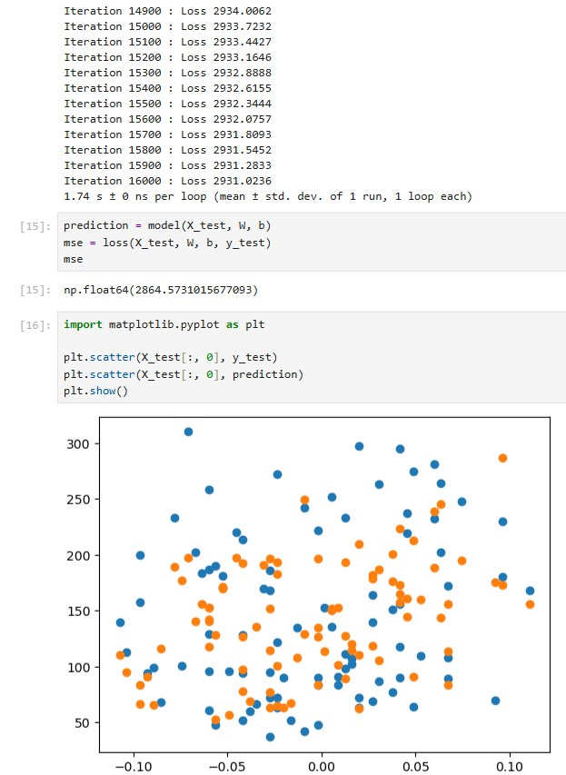
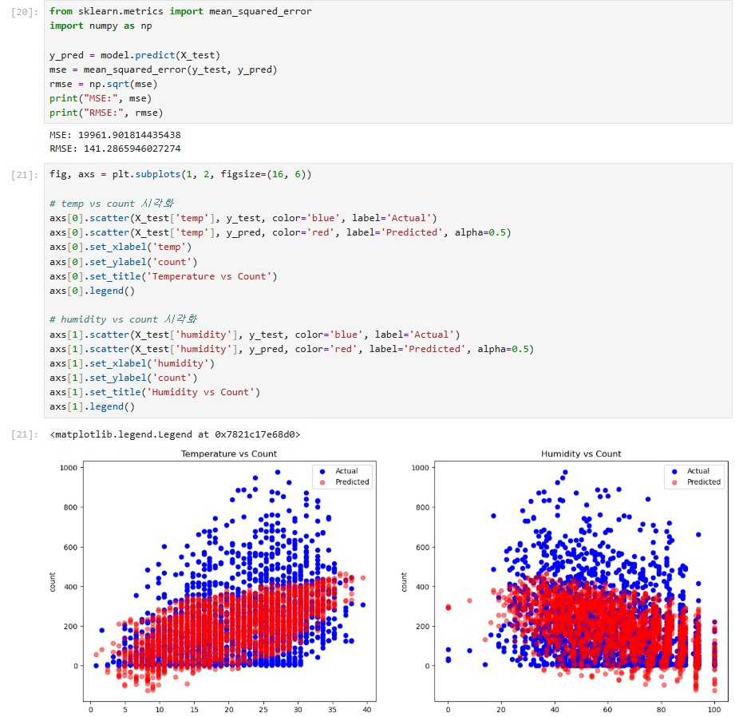
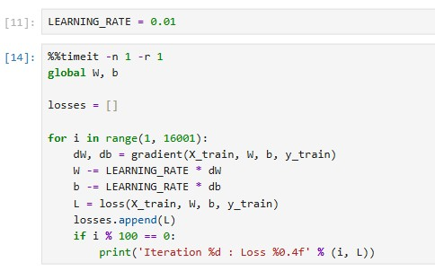

# AIFFEL Campus Online Code Peer Review Templete
- 코더 : 조희연
- 리뷰어 : 박애희


# PRT(Peer Review Template)
- [x]  **1. 주어진 문제를 해결하는 완성된 코드가 제출되었나요?**
    - 문제에서 요구하는 최종 결과물이 첨부되었는지 확인
        - 중요! 해당 조건을 만족하는 부분을 캡쳐해 근거로 첨부  


> 문제의 요구조건을 모두 만족하는 결과물이다.

    
- [x]  **2. 전체 코드에서 가장 핵심적이거나 가장 복잡하고 이해하기 어려운 부분에 작성된 
주석 또는 doc string을 보고 해당 코드가 잘 이해되었나요?**
    - 해당 코드 블럭을 왜 핵심적이라고 생각하는지 확인
    - 해당 코드 블럭에 doc string/annotation이 달려 있는지 확인
    - 해당 코드의 기능, 존재 이유, 작동 원리 등을 기술했는지 확인
    - 주석을 보고 코드 이해가 잘 되었는지 확인
        - 중요! 잘 작성되었다고 생각되는 부분을 캡쳐해 근거로 첨부  
> 주석과 doc string이 작성되지 않았다.

        
- [x]  **3. 에러가 난 부분을 디버깅하여 문제를 해결한 기록을 남겼거나
새로운 시도 또는 추가 실험을 수행해봤나요?**
    - 문제 원인 및 해결 과정을 잘 기록하였는지 확인
    - 프로젝트 평가 기준에 더해 추가적으로 수행한 나만의 시도, 
    실험이 기록되어 있는지 확인
        - 중요! 잘 작성되었다고 생각되는 부분을 캡쳐해 근거로 첨부  


> 나는 LEARNING_RATE를 0.2로 잡고 피처를 수정했고 모델학습은 3000회로 했는데,  
> 희연님은 LEARNING_RATE를 0.1로 잡고 모델 학습을 16000회로 진행하여 로스 3000 이하로 완료하였다.

        
- [x]  **4. 회고를 잘 작성했나요?**
    - 주어진 문제를 해결하는 완성된 코드 내지 프로젝트 결과물에 대해
    배운점과 아쉬운점, 느낀점 등이 기록되어 있는지 확인
    - 전체 코드 실행 플로우를 그래프로 그려서 이해를 돕고 있는지 확인
        - 중요! 잘 작성되었다고 생각되는 부분을 캡쳐해 근거로 첨부  
> 회고를 작성하지 않았다.  
> 나도 작성하지 않았다는 걸 지금 알았다...일단 나부터 회고하는 습관을 들여야 할 것 같다. 

        
- [x]  **5. 코드가 간결하고 효율적인가요?**
    - 파이썬 스타일 가이드 (PEP8) 를 준수하였는지 확인
    - 코드 중복을 최소화하고 범용적으로 사용할 수 있도록 함수화/모듈화했는지 확인
        - 중요! 잘 작성되었다고 생각되는 부분을 캡쳐해 근거로 첨부  
> 부분별로 깔끔하게 정리하셔서 보기 편하게 작성되었다.


# 회고(참고 링크 및 코드 개선)
```
# 리뷰어의 회고를 작성합니다.
# 코드 리뷰 시 참고한 링크가 있다면 링크와 간략한 설명을 첨부합니다.
# 코드 리뷰를 통해 개선한 코드가 있다면 코드와 간략한 설명을 첨부합니다.
```

문제 요구조건에 맞게 모든 요구조건을 충족하여 아주 깔끔하게 완료하셨다. 
  
추가하시면 좋을 것 같은 부분 추천드리자면 퍼실님께서 그래프 시각화 수정과 2번째 문제 피처 엔지니어링도 시도해보면 좋을 것 같다고 하셨는데 진행하지 않으신 것 같아서 나중에라도 해보시면 좋을 것 같다.   
그리고 주석을 달아두면 나중에 스스로 코드를 다시 참고하며 볼 때 편할 것 같아서 주석 달아두시는 걸 추천드리고 싶다. 나는 주석 달아두는 이유가 내가 내 코드를 다시 봤을 때도 대부분 헷갈리고 기억도 잘 못하는 편이기 때문에... 나랑 다르실 수도 있으니 편하신 정도만 추천드린다.