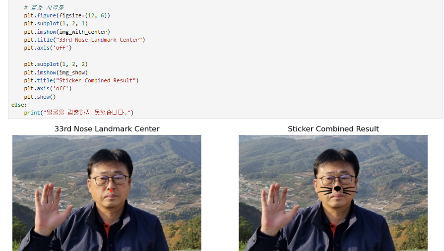
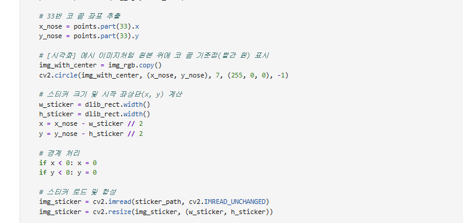
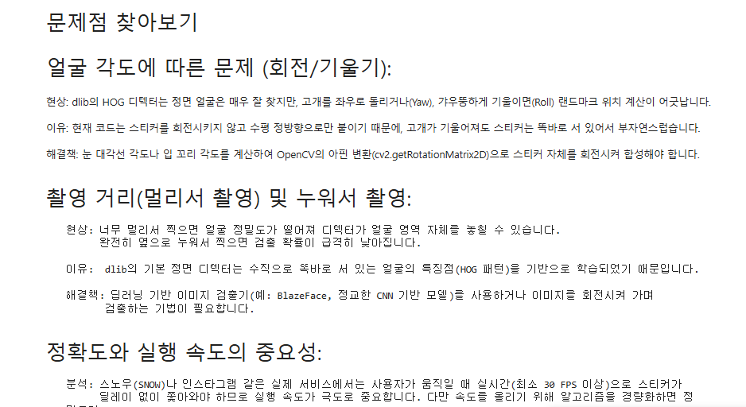

# AIFFEL Campus Online Code Peer Review Templete
- 코더 : 조희연
- 리뷰어 : 이소연

# PRT(Peer Review Template)
- [x]  **1. 주어진 문제를 해결하는 완성된 코드가 제출되었나요?**
    - 문제에서 요구하는 최종 결과물이 첨부되었는지 확인
        - 중요! 해당 조건을 만족하는 부분을 캡쳐해 근거로 첨부

주어진 문제의 코드가 제출되어 결과 사진 또한 잘 제출 되었다.

  
- [x]  **2. 전체 코드에서 가장 핵심적이거나 가장 복잡하고 이해하기 어려운 부분에 작성된 주석 또는 doc string을 보고 해당 코드가 잘 이해되었나요?**
    - 해당 코드 블럭을 왜 핵심적이라고 생각하는지 확인
    - 해당 코드 블럭에 doc string/annotation이 달려 있는지 확인
    - 해당 코드의 기능, 존재 이유, 작동 원리 등을 기술했는지 확인
    - 주석을 보고 코드 이해가 잘 되었는지 확인
        - 중요! 잘 작성되었다고 생각되는 부분을 캡쳐해 근거로 첨부

주석이 달려 이해하기 쉬웠다.

  
- [x]  **3. 에러가 난 부분을 디버깅하여 문제를 해결한 기록을 남겼거나 새로운 시도 또는 추가 실험을 수행해봤나요?**
    - 문제 해결 과정(시도/실패/재시도)을 기록했는지 확인
        - 중요! 해당 내용이 기록된 부분을 캡쳐해 근거로 첨부

이미지 회전, 이미지 밝기, 촬영거리 변경 등 여러 추가 실험을 하여 코드를 작성하였고 결과 또한 도출하였다. 또한 그에 대한 문제점 분석를 남겼다.

  
- [x]  **4. 회고를 잘 작성했나요?**
    - 배운 점/개선점/다음 계획이 포함되어 있는지 확인

여러 추가 실험을 하여 그에 대한 문제점과 개선점을 남겼고, 그에 대한 해결책 또한 남겨서 잘 작성된 과제였다.

  