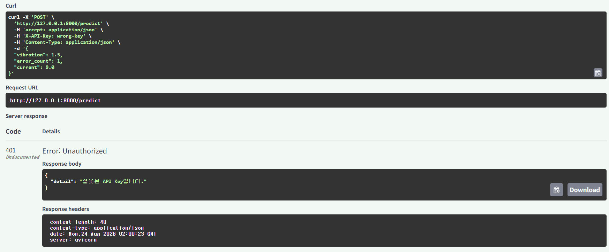
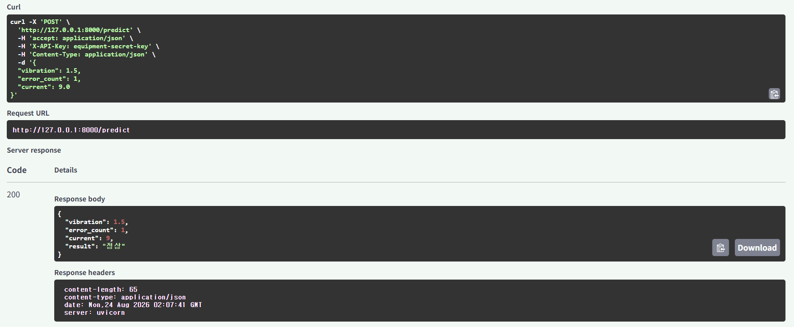
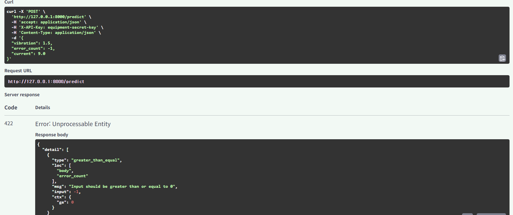

## 1. 프로젝트 개요

본 프로젝트는 **머신러닝 모델 배포 학습**을 목적으로 구현한
절삭가공 설비 이상 예측 서비스이다.

교육용 가상 데이터를 이용하여 `LogisticRegression` 모델을 학습하고,
학습된 모델을 `joblib`으로 저장한 뒤 FastAPI에서 모델을 불러와
API 형태로 배포하였다.

사용자는 Streamlit UI에서 다음 3개의 설비 데이터를 입력할 수 있다.

- 진동값
- 오류 발생 횟수
- 전류값(A)

입력된 데이터는 FastAPI의 `POST /predict` API로 전달되며,
저장된 LogisticRegression 모델이 설비 상태를 다음 두 가지로 분류한다.

- `1` = 정상
- `0` = 이상

최종 서비스에는 다음 기능을 구현하였다.

- FastAPI 백엔드
- `POST /predict` 추론 API
- Pydantic 입력값 검증
- API Key 인증
- `run_in_executor`를 이용한 비동기 추론 처리
- 잘못된 요청에 대한 HTTP 에러 처리
- Streamlit 사용자 UI
- 정상 / 이상 예측 결과 표시

> **주의:** 본 프로젝트에서 사용하는 데이터는 모델 배포 학습을 위해 구성한 교육용 가상 데이터이다.  
> 따라서 실제 절삭가공 설비의 고장 또는 이상 상태를 검증한 결과가 아니다.

---

# 2. 프로젝트 목표

본 프로젝트의 목적은 모델 자체의 높은 예측 성능을 검증하는 것이 아니라,
**머신러닝 모델을 실제 서비스 형태로 배포하는 전체 과정**을 구현하고 이해하는 것이다.

전체 구현 과정은 다음과 같다.

```text
교육용 설비 데이터 생성
        ↓
LogisticRegression 학습
        ↓
equipment_model.pkl 저장
        ↓
FastAPI에서 모델 로드
        ↓
POST /predict API 구현
        ↓
Pydantic 입력 검증
        ↓
API Key 인증
        ↓
run_in_executor 비동기 추론
        ↓
에러 처리
        ↓
Streamlit UI → API 호출
        ↓
정상 / 이상 결과 표시
```

특히 최종 프로젝트에서는 단순히 모델을 API와 연결하는 것에서 끝나지 않고
**인증, 입력 검증, 비동기 추론, 에러 처리까지 포함한 모델 배포 구조**를 구현하였다.

---

# 3. 프로젝트 구조

최종 프로젝트의 파일 구조는 다음과 같다.

```text
equipment_anomaly_prediction_service/
│
├── images/
│   ├── 설비이상 예측 프로젝트 API Key 미인증 401.png
│   ├── 설비이상 예측 프로젝트 잘못된 API Key 401.png
│   ├── 설비이상 예측 프로젝트 올바른 API Key 정상예측 200.png
│   ├── 설비이상 예측 프로젝트 입력검증 오류 422.png
│   ├── 설비이상 예측 프로젝트 Streamlit 정상 예측(OK).png
│   └── 설비이상 예측 프로젝트 Streamlit 이상 예측(NG).png
│
├── auth.py
├── train_model.py
├── equipment_model.pkl
├── main.py
├── streamlit_app.py
├── requirements.txt
└── README.md
```

## 3.1 파일별 역할

### `train_model.py`

- 교육용 설비 데이터 생성
- LogisticRegression 모델 생성
- 모델 학습
- 학습된 모델을 `equipment_model.pkl`로 저장

### `equipment_model.pkl`

- 학습 완료된 LogisticRegression 모델 파일
- FastAPI 서버에서 불러와 예측에 사용

### `auth.py`

API Key 인증을 담당한다.

요청 Header의 `X-API-Key`를 확인하여 다음과 같이 처리한다.

```text
API Key 없음
      ↓
401 Unauthorized

잘못된 API Key
      ↓
401 Unauthorized

올바른 API Key
      ↓
POST /predict 실행 허용
```

### `main.py`

FastAPI 백엔드 애플리케이션이다.

주요 기능은 다음과 같다.

- 저장된 `equipment_model.pkl` 로드
- `GET /health` 제공
- `POST /predict` 제공
- Pydantic 입력값 검증
- `Depends(verify_api_key)`를 이용한 API Key 인증
- `run_in_executor`를 이용한 모델 추론
- 예외 발생 시 HTTP 에러 처리

### `streamlit_app.py`

사용자가 직접 설비 데이터를 입력하는 프론트엔드 UI이다.

주요 기능은 다음과 같다.

- 진동값 입력
- 오류 발생 횟수 입력
- 전류값 입력
- API Key를 포함하여 FastAPI 호출
- API 응답 확인
- 정상 / 이상 결과 표시
- 서버 연결 및 요청 오류 처리

### `requirements.txt`

프로젝트 실행에 필요한 Python 라이브러리와 버전을 기록한다.

### `images/`

최종 서비스 실행 및 검증 결과 캡처를 저장한다.

주요 검증 항목은 다음과 같다.

- API Key 미인증 → `401`
- 잘못된 API Key → `401`
- 올바른 API Key → `200`
- 잘못된 입력값 → `422`
- Streamlit 정상 예측
- Streamlit 이상 예측

---

# 4. LogisticRegression 모델

## 4.1 LogisticRegression이란?

`LogisticRegression`은 한국어로 **로지스틱 회귀**라고 한다.

이름에는 Regression(회귀)이 포함되어 있지만,
주로 데이터를 여러 종류로 구분하는 **분류(Classification) 모델**로 사용된다.

본 프로젝트에서는 설비 상태를 두 가지로 구분하는
**이진 분류(Binary Classification)** 문제에 사용하였다.

```text
진동값
오류 발생 횟수
전류값
    ↓
LogisticRegression
    ↓
정상(1) / 이상(0)
```

---

## 4.2 모델 입력값

모델의 입력 변수는 다음 3개이다.

```text
진동값
오류 발생 횟수
전류값
```

예를 들어 다음 설비 데이터가 입력될 수 있다.

```text
진동값 = 1.5
오류 발생 횟수 = 1
전류값 = 9.0 A
```

모델에는 다음과 같은 하나의 입력 데이터로 전달된다.

```python
[1.5, 1, 9.0]
```

---

## 4.3 학습 데이터

본 프로젝트에서는 모델 배포 학습을 위해
교육용 가상 설비 데이터를 사용하였다.

데이터의 기본 구조는 다음과 같다.

```text
[진동값, 오류 발생 횟수, 전류값] → 설비 상태
```

예:

```text
[1.5, 1, 9.0]  → 정상(1)

[5.0, 6, 14.5] → 이상(0)
```

LogisticRegression은 여러 학습 데이터에서
입력 변수와 정상/이상 결과의 관계를 학습한다.

새로운 설비 데이터가 입력되면 학습된 분류 기준을 이용하여
정상 또는 이상을 예측한다.

> 각 센서값에 사람이 직접 `AND` 조건을 설정하여 판정하는 방식이 아니라,
> 여러 입력 변수와 정답 데이터를 이용하여 모델이 분류 기준을 학습하는 방식이다.

또한 본 프로젝트의 학습 데이터는 실제 설비에서 수집된 데이터가 아니라
**모델 배포 구조를 학습하기 위한 교육용 가상 데이터**이다.

---

# 5. 모델 학습 및 저장

`train_model.py`에서 LogisticRegression 모델을 생성한다.

```python
model = LogisticRegression(max_iter=1000)
```

학습 데이터를 이용하여 모델을 학습한다.

```python
model.fit(X, y)
```

학습된 모델은 `joblib`을 이용하여 저장한다.

```python
joblib.dump(model, "equipment_model.pkl")
```

## 5.1 실행 명령

```powershell
python train_model.py
```

정상적으로 실행되면 `equipment_model.pkl` 파일이 생성된다.

전체 과정은 다음과 같다.

```text
교육용 설비 데이터
        ↓
LogisticRegression
        ↓
model.fit()
        ↓
모델 학습
        ↓
joblib.dump()
        ↓
equipment_model.pkl
```

이후 FastAPI 서버에서는 모델을 다시 학습하지 않고
저장된 `equipment_model.pkl`을 불러와 추론에 사용한다.

---

# 6. FastAPI 모델 배포

학습된 LogisticRegression 모델을 서비스에서 사용할 수 있도록
FastAPI 백엔드와 연결하였다.

FastAPI 서버 시작 시 저장된 모델을 불러온다.

```python
model = joblib.load("equipment_model.pkl")
```

따라서 API 요청이 들어올 때마다 모델을 다시 학습하는 것이 아니라
**이미 학습된 모델을 이용하여 예측만 수행한다.**

최종 FastAPI 서비스는 다음 구조로 동작한다.

```text
사용자 요청
     ↓
POST /predict
     ↓
API Key 인증
     ↓
Pydantic 입력 검증
     ↓
FastAPI
     ↓
run_in_executor
     ↓
equipment_model.pkl
     ↓
LogisticRegression.predict()
     ↓
정상 / 이상
     ↓
HTTP Response
```

---

## 6.1 GET /health

`GET /health`는 FastAPI 서버가 정상적으로 동작하는지 확인하기 위한
상태 확인용 API이다.

예:

```json
{
  "status": "ok",
  "model": "LogisticRegression"
}
```

HTTP `200 OK`가 반환되면 서버가 요청에 정상적으로 응답하고 있음을
확인할 수 있다.

> `/health`는 설비 상태를 예측하는 API가 아니라
> **API 서버의 동작 상태를 확인하기 위한 엔드포인트**이다.

---

## 6.2 POST /predict

`POST /predict`는 실제 설비 상태 예측을 수행하는 API이다.

Request Body 예:

```json
{
  "vibration": 1.5,
  "error_count": 1,
  "current": 9.0
}
```

또한 `/predict`를 사용하려면 요청 Header에 올바른 API Key가 필요하다.

```text
X-API-Key: [설정된 API Key]
```

처리 과정은 다음과 같다.

```text
POST /predict
      ↓
X-API-Key 확인
      ↓
Depends(verify_api_key)
      ↓
Pydantic 입력 검증
      ↓
run_in_executor
      ↓
LogisticRegression.predict()
      ↓
정상 / 이상
      ↓
Response
```

---

## 6.3 API Key 인증

`auth.py`의 `verify_api_key()`를 이용하여
`X-API-Key` Header를 확인한다.

FastAPI에서는 다음과 같이 `Depends()`를 통해 인증 기능을 연결한다.

```python
Depends(verify_api_key)
```

테스트 결과 다음 세 가지 경우를 확인하였다.

```text
API Key 없음
   ↓
401 Unauthorized

잘못된 API Key
   ↓
401 Unauthorized

올바른 API Key
   ↓
200 OK
   ↓
모델 추론 실행
```

이를 통해 인증되지 않은 사용자의 `/predict` 접근을 제한하였다.

---

## 6.4 Pydantic 입력 검증

사용자가 전달한 설비 데이터는 모델에 바로 전달하지 않고
Pydantic을 통해 먼저 검증한다.

예를 들어 오류 발생 횟수는 음수가 될 수 없도록
0 이상의 값을 요구한다.

잘못된 입력 예:

```json
{
  "vibration": 1.5,
  "error_count": -1,
  "current": 9.0
}
```

이 경우 모델 추론을 수행하지 않고 HTTP `422 Unprocessable Entity`가
반환되는 것을 실행 테스트에서 확인하였다.

따라서 Pydantic은 **잘못된 데이터가 모델에 전달되는 것을 사전에 차단하는 역할**을 한다.

---

## 6.5 비동기 모델 추론

머신러닝 모델의 `predict()`는 동기 방식으로 실행되는 함수이다.

본 프로젝트에서는 FastAPI의 비동기 처리 구조에서 모델 추론 작업을
처리하기 위해 `run_in_executor`를 사용하였다.

```text
async API
    ↓
run_in_executor
    ↓
model.predict()
    ↓
예측 결과
```

이를 통해 동기 방식의 모델 추론 작업을 비동기 API 구조와 연결하였다.

---

## 6.6 에러 처리

최종 서비스에서는 정상적인 예측뿐만 아니라
잘못된 요청과 서버 연결 문제도 처리하도록 구현하였다.

주요 처리 항목은 다음과 같다.

```text
API Key 없음
→ 401 Unauthorized

잘못된 API Key
→ 401 Unauthorized

Pydantic 입력 검증 실패
→ 422 Unprocessable Entity

FastAPI 서버 연결 실패
→ Streamlit 오류 메시지 표시

서버 응답 시간 초과
→ Streamlit 오류 메시지 표시

기타 예외
→ 오류 메시지 표시
```

따라서 최종 프로젝트는 단순한 모델 예측 코드가 아니라
**인증 + 입력 검증 + 비동기 추론 + 에러 처리를 포함한 모델 배포 서비스 구조**로 구성하였다.

---

# 7. 프로젝트 실행 내역

본 프로젝트에서는 절삭가공 설비의 **진동값, 오류 발생 횟수, 전류값**을 입력받아
LogisticRegression 모델을 통해 설비 상태를 `정상 / 이상`으로 예측하는 서비스를 구현하였다.

구현된 서비스는 다음 항목을 중심으로 실행 테스트하였다.

- API Key 미입력 시 인증 차단
- 잘못된 API Key 입력 시 인증 차단
- 올바른 API Key 입력 시 정상 추론
- 잘못된 입력값에 대한 Pydantic 검증
- Streamlit UI 정상 예측
- Streamlit UI 이상 예측

---

## 7.1 API Key 미인증 테스트 — 401

API Key를 입력하지 않고 `POST /predict`를 요청하였다.

FastAPI 서버에서 요청을 차단하고 HTTP `401 Unauthorized`를 반환하였다.

```json
{
  "detail": "API Key가 필요합니다."
}
```

이를 통해 API Key가 없는 사용자의 모델 추론 요청이 차단되는 것을 확인하였다.


---

## 7.2 잘못된 API Key 테스트 — 401

잘못된 API Key를 입력하여 `POST /predict`를 실행하였다.

서버에서 입력된 API Key가 올바르지 않음을 확인하고 HTTP `401 Unauthorized`를 반환하였다.

```json
{
  "detail": "잘못된 API Key입니다."
}
```

이를 통해 잘못된 인증정보를 사용한 API 접근이 차단되는 것을 확인하였다.



---

## 7.3 올바른 API Key 정상 예측 — 200

올바른 API Key와 다음 설비 데이터를 입력하였다.

```json
{
  "vibration": 1.5,
  "error_count": 1,
  "current": 9.0
}
```

서버 응답:

```json
{
  "vibration": 1.5,
  "error_count": 1,
  "current": 9.0,
  "result": "정상"
}
```

HTTP `200 OK`가 반환되었으며 설비 상태가 `정상`으로 예측되었다.

이를 통해 **API Key 인증 → FastAPI → 모델 추론 → 결과 반환** 과정이 정상적으로 동작하는 것을 확인하였다.



---

## 7.4 잘못된 입력값 검증 — 422

Pydantic 입력 검증을 확인하기 위해 오류 발생 횟수에 음수 값을 입력하였다.

```json
{
  "vibration": 1.5,
  "error_count": -1,
  "current": 9.0
}
```

`error_count`는 0 이상이어야 하므로 입력 조건을 만족하지 않는다.

FastAPI/Pydantic에서 해당 요청을 모델에 전달하지 않고 HTTP `422 Unprocessable Entity`를 반환하였다.

이를 통해 잘못된 입력값이 모델 추론 단계로 전달되기 전에 차단되는 것을 확인하였다.



---

## 7.5 Streamlit UI 정상 예측

Streamlit UI에 다음 값을 입력하였다.

```text
진동값       : 1.5
오류 발생 횟수 : 1
전류값       : 9.0 A
```

`설비 상태 예측` 버튼을 클릭한 결과:

```text
설비 상태: 정상
```

이 결과를 통해 Streamlit에서 입력한 데이터가 FastAPI의 `/predict` API로 전달되고,
모델의 예측 결과가 다시 Streamlit 화면에 표시되는 것을 확인하였다.

.png)

---

## 7.6 Streamlit UI 이상 예측

다음과 같이 상대적으로 높은 진동값, 오류 발생 횟수 및 전류값을 입력하였다.

```text
진동값       : 5.0
오류 발생 횟수 : 6
전류값       : 14.5 A
```

실행 결과:

```text
설비 상태: 이상
```

이를 통해 동일한 Streamlit UI에서 입력값에 따라 `정상 / 이상` 분류 결과가 표시되는 것을 확인하였다.

.png)

---

# 8. Day 8 최종 체크포인트

## Q1. 본인의 프로젝트에서 Pydantic 검증은 어떤 잘못된 입력을 막아줍니까?

본 프로젝트에서는 설비의 `진동값`, `오류 발생 횟수`, `전류값`을 입력받는다.

Pydantic을 이용하여 입력 데이터의 자료형과 허용 범위를 검증한다.

예를 들어 오류 발생 횟수(`error_count`)는 0 이상이어야 한다.
따라서 `-1`과 같은 잘못된 값이 입력되면 모델에 전달하지 않고
HTTP `422 Unprocessable Entity` 오류를 반환한다.

즉, **잘못된 데이터가 모델 추론 단계까지 들어가는 것을 사전에 방지하는 역할**을 한다.

---

## Q2. Depends(verify_api_key)를 제거하면 어떤 위험이 있습니까?

`Depends(verify_api_key)`는 `/predict` API를 실행하기 전에 API Key를 확인한다.

이를 제거하면 인증되지 않은 사용자도 `/predict` API를 호출하여 모델을 사용할 수 있게 된다.

따라서 다음과 같은 문제가 발생할 수 있다.

- 허가되지 않은 사용자의 API 접근
- 무단 모델 사용
- 불필요하거나 반복적인 요청으로 인한 서버 자원 사용
- 서비스 보안 저하

따라서 실제 모델 배포 서비스에서는 인증 기능이 중요하다.

---

## Q3. run_in_executor를 사용한 이유는 무엇입니까?

머신러닝 모델의 `predict()`는 일반적인 동기 함수이다.

이를 FastAPI의 `async` 엔드포인트 안에서 직접 실행하면,
모델 추론이 오래 걸리는 경우 해당 작업이 처리되는 동안 이벤트 루프가 영향을 받을 수 있다.

`run_in_executor`를 사용하면 모델의 동기 추론 작업을 별도의 실행 영역에서 처리할 수 있어
FastAPI 서버가 다른 요청을 처리하는 데 미치는 영향을 줄일 수 있다.

즉,

```text
API 요청
   ↓
async FastAPI
   ↓
run_in_executor
   ↓
model.predict()
   ↓
예측 결과 반환
```

구조로 동기 방식의 모델 추론을 비동기 API에서 보다 안전하게 처리하기 위해 사용하였다.

---

## Q4. Day 1~8 중 가장 많이 참고한 Day는 어디였습니까? 왜?

가장 많이 참고한 부분은 **Day 6의 API Key 인증과 Day 3의 비동기 처리 및 에러 핸들링 내용**이다.

Day 6에서 학습한 API Key 인증 구조를 참고하여 `auth.py`와
`Depends(verify_api_key)`를 적용하였다.

또한 모델 추론 과정에서는 이전에 학습한 비동기 처리 방식인
`run_in_executor` 구조를 참고하였다.

이를 통해 이전 Day에서 각각 학습했던 기능을 하나의 프로젝트에 결합할 수 있었다.

---

## Q5. 이 서비스를 실제로 배포하려면 추가로 무엇이 필요합니까?

현재 프로젝트는 모델 배포 과정을 학습하기 위한 교육용 프로젝트이며
학습 데이터도 가상 데이터이다.

실제 절삭가공 설비에 적용하려면 다음 작업이 추가로 필요하다.

- 실제 설비의 진동, 오류 및 전류 데이터 수집
- 충분한 정상/이상 학습 데이터 확보
- 실제 데이터 기반 모델 재학습 및 성능 검증
- 실제 서버 또는 클라우드 환경에 FastAPI 배포
- API Key 등 인증정보의 안전한 관리
- 데이터베이스 및 로그 저장 기능
- HTTPS 등 네트워크 보안 적용
- 장애 대응 및 모델 모니터링

따라서 현재 프로젝트는 **모델 배포 구조를 구현한 교육용 프로토타입**이며,
실제 현장 적용 전에는 실제 데이터를 이용한 추가적인 모델 검증이 필요하다.

---

# 9. 프로젝트 회고

## 스스로 돌아보기

### Day 1~7 교안 없이 코드를 작성할 수 있었는가?

기본적인 FastAPI와 Streamlit 구조는 이해할 수 있었지만,
전체 코드를 처음부터 교안 없이 작성하기에는 아직 어려움이 있었다.

### 어떤 부분에서 교안을 다시 찾아봤는가?

API Key 인증, `Depends`, 비동기 추론의 `run_in_executor`,
Pydantic 입력 검증 및 에러 처리 부분을 다시 확인하였다.

### 다음에 다시 만든다면 무엇을 다르게 하겠는가?

처음부터 프로젝트 요구사항을 기준으로
**FastAPI → 인증 → 입력 검증 → 비동기 추론 → Streamlit → 에러 처리** 순서로
구조를 먼저 설계한 후 코드를 작성하고 테스트하겠다.

---


> 본 프로젝트는 모델 배포 학습을 위한 교육용 프로젝트이며 가상 데이터로 학습한 모델을 사용하였다. 따라서 현재 결과를 실제 절삭가공 설비의 이상 예측 성능으로 해석할 수 없으며, 현장 적용을 위해서는 실제 설비 데이터를 이용한 별도의 학습 및 성능 검증이 필요하다.